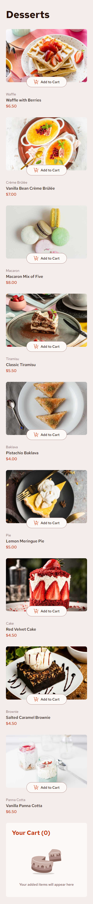
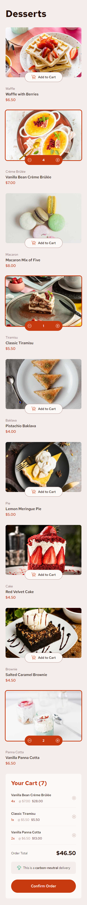
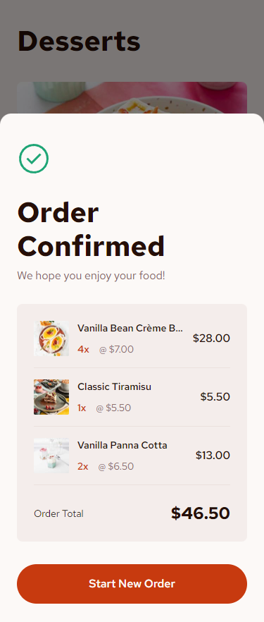
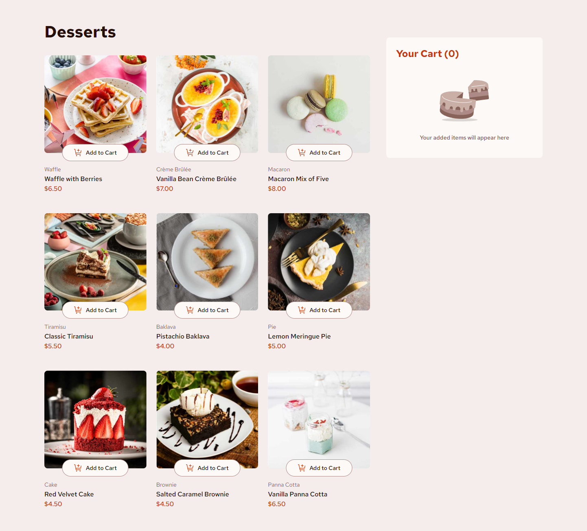
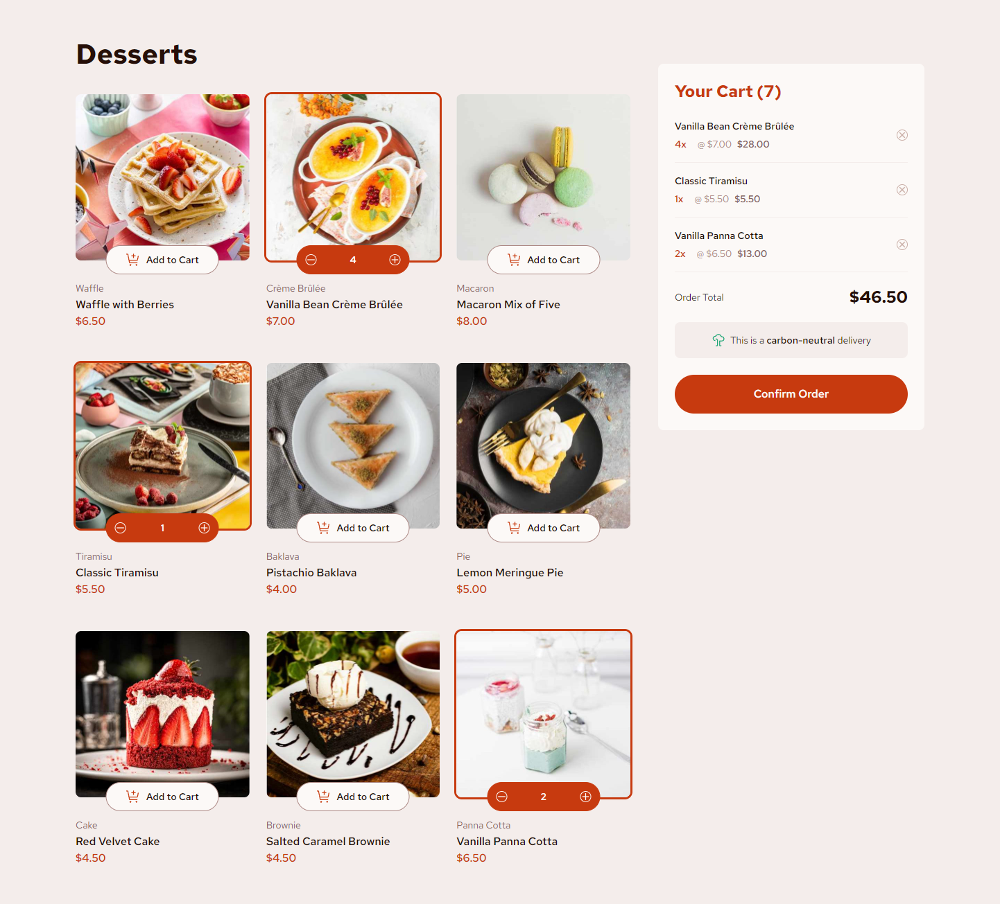
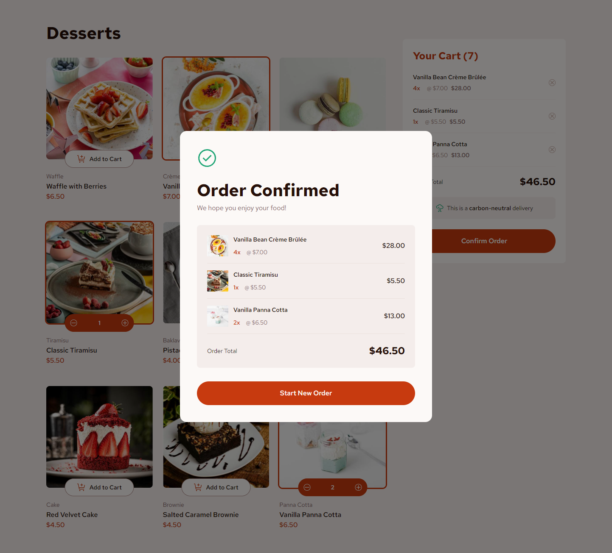
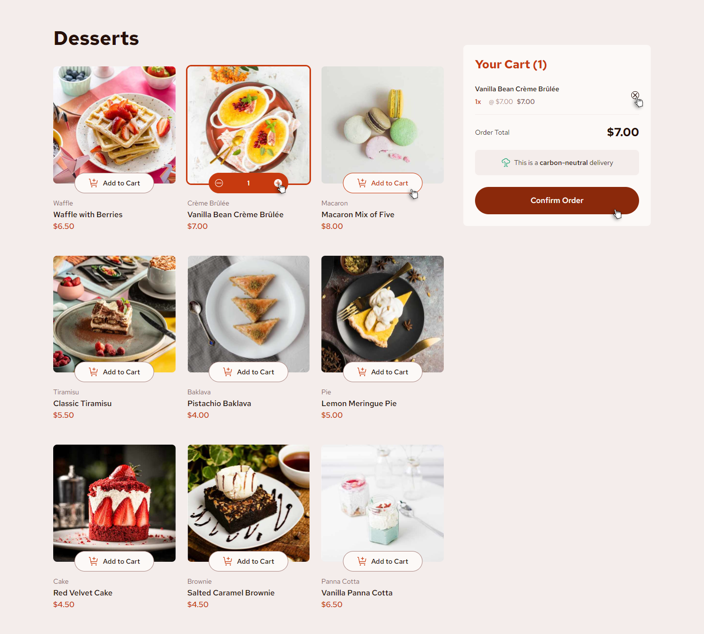

# Frontend Mentor - Product list with cart solution

This is a solution to the [Product list with cart challenge on Frontend Mentor](https://www.frontendmentor.io/challenges/product-list-with-cart-5MmqLVAp_d).

## Table of contents

- [Overview](#overview)
  - [The challenge](#the-challenge)
  - [Screenshot](#screenshot)
  - [Links](#links)
- [My process](#my-process)
  - [Built with](#built-with)
- [Author](#author)

## Overview

### The challenge

Users should be able to:

- Add items to the cart and remove them
- Increase/decrease the number of items in the cart
- See an order confirmation modal when they click "Confirm Order"
- Reset their selections when they click "Start New Order"
- View the optimal layout for the interface depending on their device's screen size
- See hover and focus states for all interactive elements on the page

### Screenshot

### Links

- Live Site URL: [https://nkshey.github.io/desserts-order-page/](https://nkshey.github.io/desserts-order-page/)
- Solution URL: [https://github.com/nkshey/desserts-order-page](https://github.com/nkshey/desserts-order-page)

## My process

### Built with

- Semantic HTML5 markup
- CSS custom properties
- Flexbox
- CSS Grid
- Mobile-first workflow
- [React](https://reactjs.org/) - JS library
- [Vite](https://vitejs.dev/) - Build tool
- [Zustand](https://zustand-demo.pmnd.rs/) - For state management
- [Tailwind CSS](https://tailwindcss.com/) - For styles

## Author

- LinkedIn - [Nikoloz Peikrishvili](https://www.linkedin.com/in/nikapeikrishvili/)
- Frontend Mentor - [@nkshey](https://www.frontendmentor.io/profile/nkshey)
